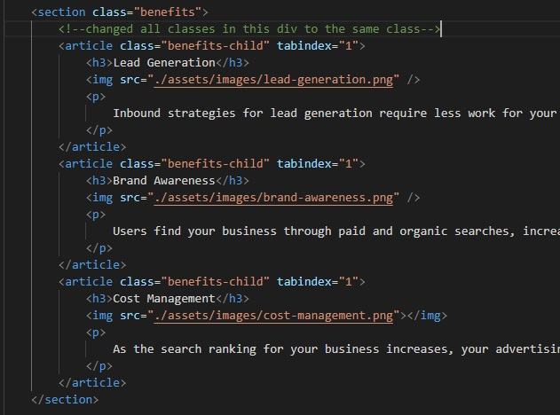

In this Project I have reduced redundancies in the CSS, made the site 
navigable via keyboard, and added alt attribues to the images. 
Additionally I have added replaced existant div elements with appropriate 
semantic elements, and made sure all styling and images are located in the 
css and html respectively.

